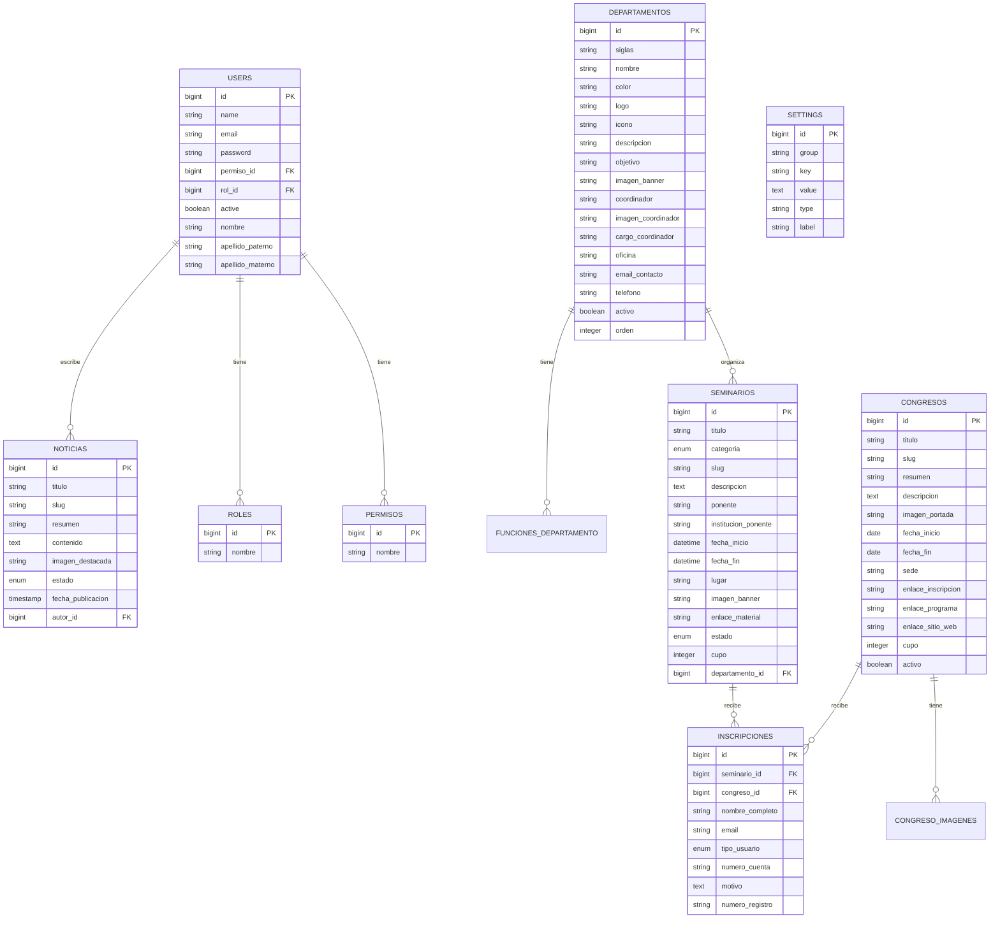

# Guía Técnica del Proyecto SM_Oscar (SCRUMS_UIM)

## 1. Introducción y Stack Tecnológico

El proyecto **SM_Oscar** es una plataforma web construida con **Laravel 11** que gestiona:
*   Congresos académicos y científicos.
*   Seminarios e investigación.
*   Departamentos universitarios.
*   Inscripciones de usuarios a eventos.
*   Noticias y configuración general del sitio.

Cuenta con dos áreas principales integradas:
1.  **Área Pública y de Usuario Autenticado**: Accesible desde la raíz (`/`), permite la navegación pública y ofrece un dashboard para usuarios logueados.
2.  **Panel de Administración**: Accesible desde `/admin/*`, protegido para usuarios con roles de administrador.

Además, cuenta con una **API REST** bajo el prefijo `/api/*`, protegida mediante Laravel Sanctum.

**Stack Tecnológico:**
*   **Backend**: Laravel 11 (PHP).
*   **Base de datos**: MySQL/MariaDB.
*   **Autenticación Web**: Sesiones nativas de Laravel con middleware personalizado (`auth.token`).
*   **Autenticación API**: Laravel Sanctum.
*   **Frontend**: Blade templating con CSS y JS nativo (Vanilla).

---

## 2. Base de Datos

### 2.1 Diagrama de Entidad-Relación (ERD)

### 2.2 Migraciones

Las migraciones gestionan el esquema de la base de datos de forma incremental.

| Migración (Fecha/Nombre) | Tabla Afectada / Acción | Propósito |
| :--- | :--- | :--- |
| `0000_01_01_000001_create_permisos_table` | `permisos` | Catálogo de permisos del sistema. |
| `0000_01_01_000002_create_roles_table` | `roles` | Catálogo de roles de usuario. |
| `0001_01_01_000000_create_users_table` | `users` | Almacena los usuarios, incluye llaves foráneas a permisos y roles. |
| `2025_11_22_235257_create_personal_access_tokens` | `personal_access_tokens` | Tabla para tokens de autenticación de Sanctum (API). |
| `2025_11_24_030050_create_password_reset_codes` | `password_reset_codes` | Maneja los códigos temporales para recuperar contraseñas. |
| `2026_04_04_120000_create_congresos_table` | `congresos` | Registra la información principal de los congresos. |
| `2026_05_03_000000_create_departamentos_table` | `departamentos` | Gestión de los departamentos universitarios. |
| `2026_05_03_100000_create_seminarios_table` | `seminarios` | Registro de seminarios (investigación), ligados a departamentos. |
| `2026_05_03_200000_create_settings_table` | `settings` | Configuraciones dinámicas clave-valor para personalizar el sitio. |
| `2026_05_03_300000_create_noticias_table` | `noticias` | Publicaciones o noticias del sitio, vinculadas al usuario autor. |
| `2026_05_03_400000_create_congreso_imagenes_table` | `congreso_imagenes` | Galería de imágenes para congresos. |
| `2026_05_04_000000_add_campos_to_departamentos` | `departamentos` (ALTER) | Añade campos de logo, ícono e información del coordinador. |
| `2026_05_06_042110_add_categoria_to_seminarios` | `seminarios` (ALTER) | Añade la enumeración `categoria` a seminarios. |
| `2026_05_06_045205_add_objetivo...` | `departamentos`, `funciones_departamento` | Añade `objetivo` a departamentos y crea tabla relacionada de funciones. |
| `2026_05_06_051934_add_cupo_to_seminarios_table` | `seminarios` (ALTER) | Añade el campo límite `cupo`. |
| `2026_05_06_051937_create_inscripciones_table` | `inscripciones` | Centraliza inscripciones tanto para seminarios como congresos. |
| `2026_05_06_235036_add_cupo_to_congresos_table` | `congresos` (ALTER) | Añade límite de `cupo` a congresos. |
| `2026_05_07_045524_add_verification_token...` | `users` (ALTER) | Prepara campo de verificación para usuarios. |

### 2.3 Seeders

Ubicados en `database/seeders/`, pueblan la base de datos inicial:
*   **`DatabaseSeeder`**: Orquesta la ejecución de los demás seeders.
*   **`DepartamentoSeeder`**: Carga departamentos iniciales con su configuración visual y siglas.
*   **`CongresoSeeder`**: Crea congresos de ejemplo para el entorno de desarrollo.
*   **`SeminarioSeeder`**: Pobla datos de prueba para los seminarios.
*   **`SettingsSeeder`**: Inyecta configuraciones por defecto (como las de la página *Welcome*).

---

## 3. Modelos

Los modelos interactúan con la base de datos mediante Eloquent ORM.

| Modelo | Tabla asociada | Funcionalidad y Relaciones |
| :--- | :--- | :--- |
| `User` | `users` | Maneja la autenticación. Oculta la contraseña. Relaciones: `belongsTo` a `Permiso` y `Rol`. Cuenta con un *cast* de array en el campo `asignado`. |
| `Rol` | `roles` | Catálogo simple con campo `nombre`. |
| `Permiso` | `permisos` | Catálogo simple con campo `nombre`. |
| `Congreso` | `congresos` | Registra congresos. Incluye métodos de lógica como `urlPortada()`, `hayCupo()`, `totalInscritos()` y Scopes (`activos()`, `proximosAVencer()`). Relaciones: `hasMany` a `CongresoImagen` e `Inscripcion`. |
| `CongresoImagen` | `congreso_imagenes` | Almacena los paths de la galería de un congreso. `belongsTo` `Congreso`. |
| `Seminario` | `seminarios` | Registra seminarios. Scopes para filtrado (`publicados()`, `proximos()`). Métodos `hayCupo()` y `totalInscritos()`. Relaciones: `belongsTo` `Departamento` y `hasMany` `Inscripcion`. |
| `Departamento` | `departamentos` | Atributos de área. Scopes (`activos()`, `ordenados()`). Relación: `hasMany` `FuncionDepartamento`. |
| `FuncionDepartamento`| `funciones_departamento`| Detalla las funciones específicas de un departamento. |
| `Inscripcion` | `inscripciones` | Modelo polivalente de registro. Contiene métodos utilitarios como `evento()`, `tipoEvento()`, `esSeminario()`, `esCongreso()`. Relaciones: `belongsTo` a `Seminario` o `Congreso`. |
| `Noticia` | `noticias` | Publicaciones del blog/muro. Scopes `publicadas()` y `recientes()`. Relación: `belongsTo` a `User` (como `autor`). |
| `Setting` | `settings` | Utiliza caché interna de Laravel (`Cache::remember`) para accesos rápidos. Contiene métodos estáticos `get()`, `set()`, y `getGroup()`. |

---

## 4. Controladores, Rutas y API

El flujo de aplicación está definido en `routes/web.php` y `routes/api.php`. Las funcionalidades de la web y la API coexisten de manera fluida compartiendo controladores en algunos casos.

### 4.1 Área Pública y de Usuario (Web)

Gestión de la navegación abierta y los paneles para usuarios registrados.

| Controlador | Métodos | Propósito |
| :--- | :--- | :--- |
| **`HomeController`** | `welcome` | Ensambla la página principal, cargando *settings*, próximos eventos y departamentos. |
| **`WebAuthController`** | `showLogin`, `login`, `showRegister`, `register`, `logout` | Maneja el ciclo completo de autenticación de sesión en la web. El registro valida un `REGISTRATION_ACCESS_KEY` y envía correos. |
| **`WebPasswordResetController`**| `showForgot`, `sendResetCode`, `showReset`, `resetPassword` | Gestión del restablecimiento de contraseñas vía web usando un código de 8 dígitos numérico enviado por correo. |
| **`Admin\CongresoController`** | `indexPublico`, `showPublico` | Muestra el catálogo de congresos y el detalle de un evento específico para el usuario final. |
| **`SeminarioController`** | `index` | Lista los seminarios publicados en la sección de investigación pública. |
| **`DepartamentoController`** | `show` | Muestra la vista detallada de un departamento basada en sus siglas. |
| **`InscripcionController`** | `store`, `storeCongreso` | Procesan la inscripción pública a Seminarios y Congresos respectivamente. Valida cupos, genera el *número de registro* único y dispara un correo de confirmación. |

### 4.2 Área de Administración (Web)

Accesible bajo el prefijo `/admin/`, protegida por los middlewares `web`, `auth.token` y `admin.or.dev`. Se encargan de las operaciones CRUD del sistema.

| Controlador | Propósito y Métodos Principales |
| :--- | :--- |
| **`Admin\DashboardController`** | Genera estadísticas globales (conteo de usuarios, congresos, seminarios, actividad reciente) para la vista principal del panel administrativo. |
| **`Admin\CongresoController`** | CRUD de Congresos (`index`, `create`, `store`, `edit`, `update`, `destroy`). Maneja la subida de imágenes, generación de slugs únicos, y un método `toggleActivo` para activar/desactivar eventos rápidamente. |
| **`Admin\SeminarioController`** | CRUD de Seminarios. Gestiona los metadatos de los ponentes, categorías, ligas de materiales y la relación con el departamento organizador. |
| **`Admin\DepartamentoController`**| CRUD de Departamentos. Gestiona múltiples cargas de archivos (banner y coordinador) y guarda dinámicamente el array de funciones del departamento. |
| **`Admin\WelcomeController`** | Administra de forma dinámica las propiedades clave-valor (`Settings`) que construyen la vista pública principal. |
| **`UserController`** | Visualización (`index`), edición (`edit`, `update`) y cambio de estado/contraseña (`toggleStatus`, `changePassword`) de los usuarios del sistema por parte del administrador. |
| **`Admin\InscripcionController`** | Listado y eliminación de registros de asistencia para Seminarios. |
| **`Admin\InscripcionCongresoController`**| Listado y eliminación de registros de asistencia para Congresos. |

### 4.3 API REST (`routes/api.php`)

Expone funcionalidades para clientes externos o integraciones, protegida por tokens de `Laravel Sanctum`.

| Endpoint | Controlador | Middleware | Propósito |
| :--- | :--- | :--- | :--- |
| `POST /api/register` | **`AuthController`** | `EnsureRegistrationKey` | Permite crear un usuario por API, validando la clave de seguridad del entorno y despachando correo de bienvenida. Retorna el token Sanctum. |
| `POST /api/login` | **`AuthController`** | - | Valida credenciales, comprueba que el usuario esté activo y devuelve un token Bearer. |
| `POST /api/forgot-password`| **`PasswordResetController`**| - | Genera el código de 8 dígitos y envía el correo de recuperación. |
| `POST /api/reset-password` | **`PasswordResetController`**| - | Restablece la contraseña validando el código de 8 dígitos recibido. |
| `GET /api/user` | **`AuthController`** | `auth:sanctum` | Devuelve el payload del usuario autenticado actualmente. |
| `POST /api/logout` | **`AuthController`** | `auth:sanctum` | Revoca el token de sesión actual. |
| `POST /api/users` | **`UserController`** | `auth:sanctum`, `CheckSuperAdmin` | Crea un usuario base (sin roles asignados) de forma administrativa. |
| `POST /api/users/admin` | **`UserController`** | `auth:sanctum`, `CheckSuperAdmin` | Crea un usuario con rol y permisos específicos. |
| `PUT /api/users/{id}` | **`UserController`** | `auth:sanctum`, `CheckSuperAdmin` | Actualiza metadatos de un usuario. |
| `PUT /api/users/{id}/password`| **`UserController`** | `auth:sanctum`, `CheckSuperAdmin` | Obliga el cambio de contraseña de un usuario mediante API. |
| `PATCH /api/users/{id}/status`| **`UserController`** | `auth:sanctum`, `CheckSuperAdmin` | Activa o inactiva la cuenta de un usuario. |
| `DELETE /api/users/{id}` | **`UserController`** | `auth:sanctum`, `CheckSuperAdmin` | Elimina la cuenta permanentemente de la BD. |

---

## 5. Vistas (Blade Templates)

El frontend está centralizado en el sistema de plantillas Blade (`resources/views/`).

### 5.1 Layouts y Estructura Base
*   **`layouts/app.blade.php`**: Layout principal para el frontend público y del usuario logueado. Carga assets, barra de navegación y pie de página.
*   **`admin/layout.blade.php`**: Layout exclusivo para el panel de administración, incluye sidebar administrativo y menús contextuales.

### 5.2 Vistas Públicas / Usuario

Se encargan de presentar la información a visitantes no autenticados y la interfaz básica para usuarios estándar.

| Ruta/Archivo | Propósito y Contenido |
| :--- | :--- |
| `welcome.blade.php` | Página principal. Ensambla la estructura invocando componentes parciales de la carpeta `dashboard/`. |
| `dashboard/hero.blade.php` | Sección superior (Hero banner) de la página de inicio. |
| `dashboard/congresos.blade.php` | Bloque visual que destaca los congresos disponibles. |
| `dashboard/noticias.blade.php` | Sección de últimas noticias publicadas. |
| `dashboard/departamentos.blade.php`| Grid visual para enlazar a la información de los departamentos. |
| `dashboard/eventos-proximos.blade.php`| Muestra un feed temporal de seminarios/congresos a punto de realizarse. |
| `dashboard/proposito.blade.php` | Misión/visión y descripción general de la institución. |
| `congresos/index.blade.php` | Directorio en forma de lista/grid de todos los congresos públicos. |
| `congresos/show.blade.php` | Detalle íntegro de un congreso, incluyendo el formulario nativo para procesar la inscripción de los asistentes. |
| `investigacion.blade.php` | Lista los seminarios e investigaciones actuales. |
| `departamento.blade.php` | Página matriz del departamento que inyecta parciales (`hero`, `sidebar`, `objetivo`, `proyectos`, `data`) específicos de esa área. |
| `auth/login.blade.php` | Formulario visual de inicio de sesión. |
| `auth/register.blade.php` | Formulario visual de registro público con solicitud de llave de acceso. |
| `auth/forgot-password.blade.php`| Formulario para solicitar el código de recuperación de cuenta. |
| `auth/reset-password.blade.php` | Formulario final para teclear la nueva contraseña usando el código recibido. |

### 5.3 Vistas de Administración (`admin/`)

Formularios y listados de datos. Por estándar, la mayoría de los módulos siguen una estructura de vistas de resource (CRUD):
*   `index.blade.php` (Listado y tablas)
*   `create.blade.php` (Llama al formulario vacío)
*   `edit.blade.php` (Llama al formulario poblado)
*   `_form.blade.php` (Partial reusable con los inputs HTML)

| Módulo/Carpeta | Propósito |
| :--- | :--- |
| `dashboard.blade.php` | Centro de comando, muestra KPI's estadísticos de la plataforma. |
| `congresos/` | Formularios para la captura de eventos grandes (fechas, slug, portadas). |
| `seminarios/` | Formularios de captura para charlas o investigación (ponentes, cupos, departamentos). |
| `departamentos/` | Interfaz robusta para editar información de las áreas (imágenes, funciones por array, encargados). |
| `usuarios/` | Panel de control de usuarios. Permite cambiar contraseñas, inhabilitar cuentas o alterar roles y permisos de acceso al panel. |
| `inscripciones/` | Tablas de datos de usuarios que se registraron a Seminarios. Permite filtrado y borrado. |
| `inscripciones_congresos/` | Tablas de datos de usuarios que se registraron a Congresos. Permite filtrado y borrado. |
| `welcome/edit.blade.php` | Panel especial de configuración de variables (`Settings`). Actúa como un CMS sencillo para alterar textos o imágenes de la landing page pública sin tocar el código fuente. |
